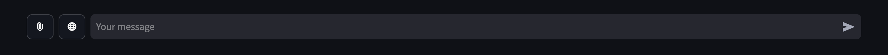
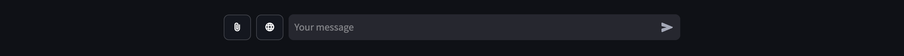
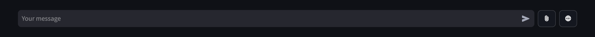
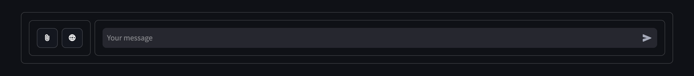
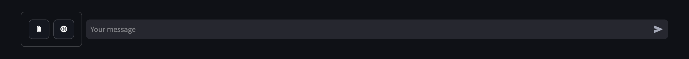
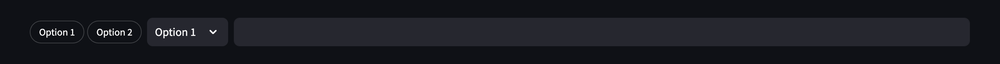
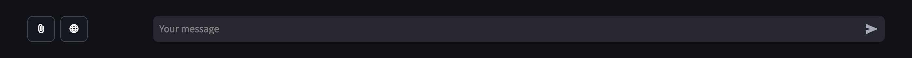

# Better Chat Input for Streamlit

`st_better_chat_input` is a function for Streamlit that enhances the default chat input field by providing customization options for layout and appearance. 
This solution isn't perfect since it uses custom CSS and tweaks hidden objects generated by Streamlit.

## Features

-   Set the orientation of elements (`left` or `right`).
-   Specify whether borders should be displayed around specific containers.
-   Add additional containers on the side and above the chat input.

## Installation

You can use `st_better_chat_input` in two ways:

1.  **Copy the function** directly into your own script.
    
2.  **Download the entire file** and import it as a module.
    

### Option 1: Copy the function

Simply copy the `st_better_chat_input` function from the source code and paste it into your Streamlit application.

### Option 2: Import from a File

If you prefer to keep the function in a separate file, download the `st_better_chat_input.py` script, place it in your project directory, and import it as follows:

```python
from st_better_chat_input import st_better_chat_input
```

## Usage

Here are some examples of how to use `st_better_chat_input` in a Streamlit application.

### 1. Basic usage:

```python
import streamlit as st
from st_better_chat_input import st_better_chat_input

# Initialize session state variable to track the first run  
if "first_run" not in st.session_state:  
    st.session_state["first_run"] = True  
  
# Create containers for buttons and input field using `st_better_chat_input`  
buttons_container, input_container = st_better_chat_input()  
  
# Adding a short delay to allow Streamlit to properly render flexbox elements.
# This prevents incorrect width calculations on first app run caused by the dynamic Streamlit rendering but does not always work.  
if st.session_state["first_run"]:  
    sleep(0.5)  
    st.session_state["first_run"] = False  
  
# Example elements placed inside respective containers  
button1 = buttons_container.button(":material/attach_file:", key="button1")  
button2 = buttons_container.button(":material/language:", key="button2")  
chat_input = input_container.chat_input(key="chat_input")
```

Works both in `wide` and `centered` app layouts.





### 2. With specified orientation:

```python
buttons_container, input_container = st_better_chat_input(orientation="right")
```



### 3. With borders:

```python
buttons_container, input_container = st_better_chat_input(borders=True)
```



Or setting individual border values:

```python
buttons_container, input_container = st_better_chat_input(borders=[False, True, False, False])
```



### 4. With different Streamlit elements:



## Potential Issues & Unresolved Bugs

Due to the way this solution works, it may not be compatible with newer or older versions of Streamlit. It has been confirmed to work with Streamlit version `1.41.1`.

While `st_better_chat_input` improves layout flexibility, some potential issues may arise:

- **Rendering Errors**: The first time the app loads, the dynamic layout may be miscalculated, causing elements to overlap (`sleep(0.5)` on the first run tries to prevent this but does not always work). If this happens, a full page reload (not just a rerun) usually resolves the issue.



- **CSS Conflicts**: Custom CSS may conflict with other Streamlit styles, leading to unexpected behavior, such as overlapping element names and styling issues.

If you encounter issues, feel free to report them!

## License

This project is released under the MIT License.
